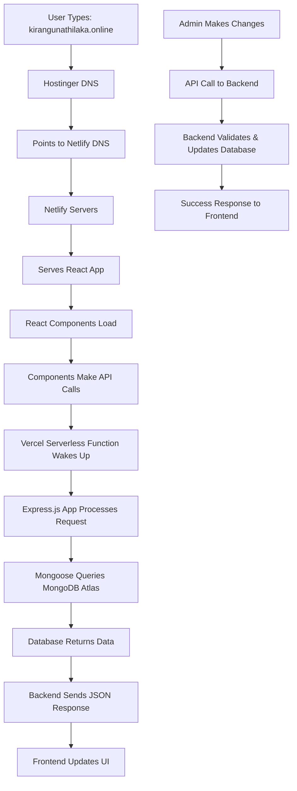

# My Portfolio

A modern full-stack web application showcasing my projects, skills, and expertise.

**Live Site:** [kirangunathilaka.online](https://kirangunathilaka.online/)

---

## 📸 Screenshots

### Frontend

### Backend Admin Dashboard

---

## 🏗️ Architecture Overview

## 🚀 Technology Stack

### Frontend (Client-Side)

1. React (UI framework)
2. Vite (build tool)
3. React Router (client-side routing)
4. Tailwind CSS (styling)
5. TypeScript (type safety)
6. Lucide React (icons)
7. EmailJS (contact form integration)

### Backend (Server-Side)

1. Node.js (JavaScript runtime)
2. Express.js (web framework)
3. Mongoose (MongoDB ODM)
4. JWT (authentication)
5. Cloudinary (image storage)
6. Helmet (security middleware)
7. CORS (cross-origin resource sharing)

### Infrastructure

1. Netlify (Frontend hosting)
2. Vercel (Backend serverless hosting)
3. MongoDB Atlas (Database cloud)
4. Hostinger (Domain registrar)
5. GitHub (Version control & CI/CD)

## 📚 What I Learned

1. CRUD Operations - Implementing Create, Read, Update, Delete functionality
2. REST API Design - Building RESTful web services with proper HTTP methods
3. Authentication & Authorization - JWT-based secure user sessions
4. Database Design - MongoDB schema design and relationships
5. DNS Management - Custom domain setup and DNS configuration
